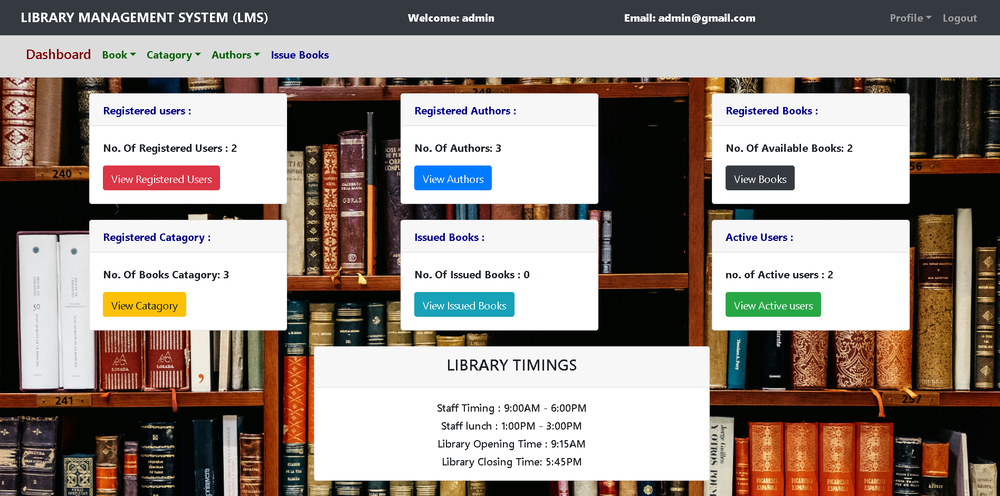

# LMS-Library-Management-System
Library Management System is a web-based app built with PHP, MySQL, HTML, CSS, and Bootstrap using XAMPP. It allows librarians to manage books, users, and issue/return records efficiently via an admin dashboard on a local Apache server.
## Screenshot

